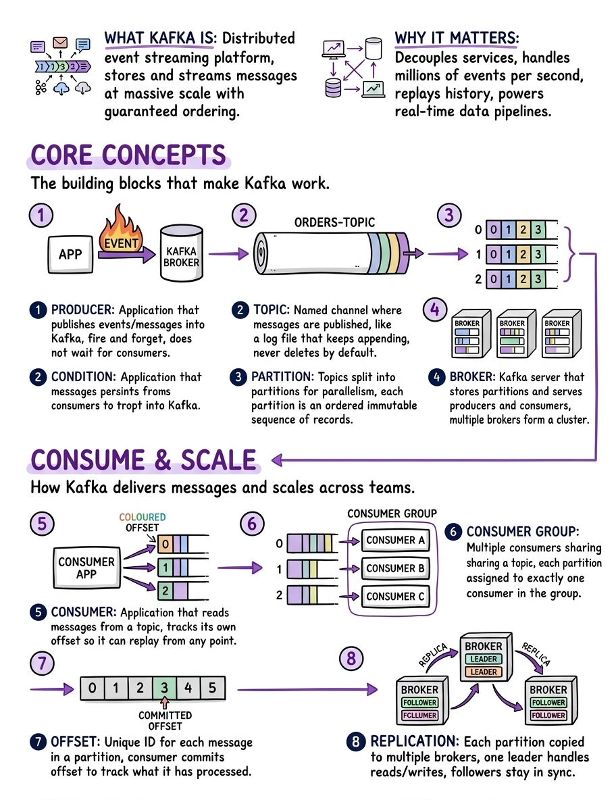

# Infographic Skill

A [Claude Code](https://claude.com/claude-code) skill that turns a topic into a branded **"HOW X WORKS"** educational infographic: a hand-drawn style diagram generated by Gemini, composited onto a branded HTML template, and screenshotted into a final PNG, plus a ready-to-post caption.

Built for backend / Java / system-design topics, but works for any technical concept.



## How it works

1. You give a topic (e.g. "Docker", "How Kafka Works").
2. Claude fills a structured prompt and calls Gemini with three reference diagrams for style matching.
3. The raw diagram is composited onto `assets/template.html` with your branding.
4. Playwright screenshots the page to a final PNG.
5. A LinkedIn-style caption is written alongside it.

## Requirements

- [Node.js](https://nodejs.org/) 18+ (with `npx`)
- A Gemini API key: https://aistudio.google.com/apikey
- Claude Code (this is a skill; the workflow lives in `SKILL.md`)

## Install

One line. Clones into `~/.claude/skills/infographic`, installs dependencies (including the headless Chromium Playwright needs), and seeds `.env`:

```bash
curl -fsSL https://raw.githubusercontent.com/amigoscode/infographics-skill/main/install.sh | bash
```

Then add your Gemini API key (get one at https://aistudio.google.com/apikey):

```bash
export GEMINI_API_KEY=...        # or edit ~/.claude/skills/infographic/.env
```

That is it. Open Claude Code and ask for an infographic (see Usage).

<details>
<summary>Manual install</summary>

```bash
git clone https://github.com/amigoscode/infographics-skill.git ~/.claude/skills/infographic
cd ~/.claude/skills/infographic
npm install                # installs deps + Chromium for Playwright
cp .env.example .env       # then add your GEMINI_API_KEY
```

</details>

## First-run branding (onboarding)

The first time the skill runs it asks you for:

- **Footer text**: the URL shown bottom-left (default `www.amigoscode.com`)
- **Logo path**: the wordmark shown bottom-center, also used as the top-left fallback icon for generic topics (default `assets/amigoscode-wordmark.svg`)

Your answers are saved to `config.json` (git-ignored). To rebrand, drop your own SVG/PNG into `assets/` and edit `config.json`:

```json
{
  "footerText": "www.yourdomain.com",
  "logoPath": "assets/your-wordmark.svg",
  "outputDir": "~/infographics"
}
```

See `config.example.json` for the shape.

## Usage

In Claude Code:

```
Create an infographic about how Docker works
```

or just name a topic. The final PNG and caption land in `<outputDir>/How <Topic> Works/`.

You can also run the generator directly:

```bash
npm run generate -- \
  --ref assets/reference-rate-limiting.jpeg \
  --ref assets/reference-linux-processes.jpeg \
  --ref assets/reference-kafka.jpeg \
  --prompt "<your prompt>" \
  --output "~/infographics/How Docker Works/raw.png"
```

## Project layout

```
infographic-skill/
├── SKILL.md                      # the skill workflow Claude follows
├── config.example.json           # template for per-user config
├── .env.example                  # template for your API key
├── package.json
└── assets/
    ├── generate-diagram.ts       # Gemini image generation
    ├── template.html             # branded slide (placeholders)
    ├── caption-examples.md        # caption hook patterns + examples
    ├── amigoscode-wordmark.svg   # default brand logo (swap for your own)
    └── reference-*.jpeg          # style reference diagrams
```

## A note on branding

The bundled `amigoscode-wordmark.svg` and `reference-*.jpeg` files are Amigoscode brand assets, included as working defaults. If you use this skill for your own content, replace them with your own logo (SVG or PNG) and references via `config.json`.

## License

[MIT](LICENSE). The Amigoscode name, logo, and reference images remain the property of Amigoscode; the MIT license covers the code and workflow, not the brand assets.
